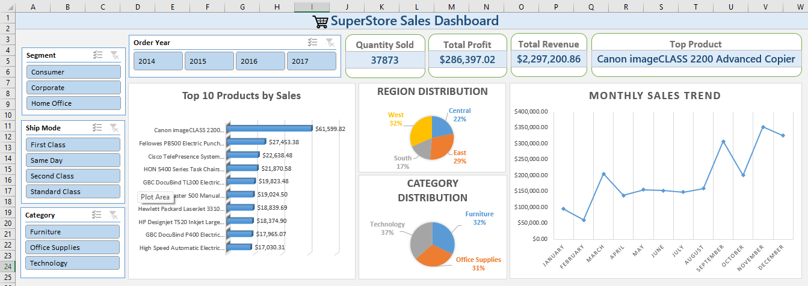

# 📊 Sales Performance Dashboard (Excel)  

This project was completed as part of my **Data Analytics Internship at Elevvo Pathways**.  
The objective of this task was to build an **interactive Sales Performance Dashboard** using Excel, based on the **Superstore Sales Dataset**.  

---

## 📌 Project Overview  
The dashboard provides a consolidated view of sales performance, enabling users to analyze key business metrics and trends through **interactive filters and visualizations**.  

It helps answer critical business questions such as:  
- Which products generate the highest revenue?  
- How are sales distributed across categories and regions?  
- What is the monthly sales trend over time?  
- Who are the top-performing segments?  

---

## 🛠️ Key Features  
- **Data Preparation & Cleaning** – formatted raw dataset to ensure accuracy and usability  
- **KPIs** – total revenue, total profit, quantity sold, and top product  
- **Pivot Tables & Charts** – summarized and visualized sales insights  
- **Visualizations**:  
  - Top 10 Products by Sales (Bar Chart)  
  - Region & Category Distribution (Pie Charts)  
  - Monthly Sales Trend (Line Chart)  
- **Slicers** – interactive filters for Segment, Ship Mode, Category, and Year  

---

## 📂 Files Included  
- `Superstore Sales Dashboard.xlsx` → Completed Excel dashboard  
- `Superstore Sales Dataset.csv` → Dataset used (Kaggle Superstore Sales)  
- `image.png` → Preview of the dashboard  

---

## 📸 Dashboard Preview  
  

---

## 🚀 Skills Applied  
- Excel basics & formulas  
- Pivot Tables & Charts  
- Business Metrics & KPIs  
- Dashboard Design & Data Visualization  

---

## 🔗 Related Internship Task  
This project corresponds to **Task 1** from the Elevvo Pathways Internship:  
*Sales Performance Dashboard using Excel*  

---

## 📜 Acknowledgement  
This project was completed as part of my **Data Analytics Internship at Elevvo Pathways**.  

