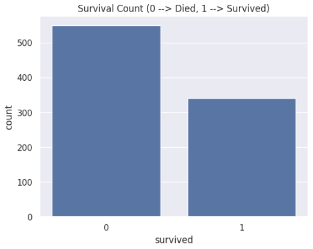
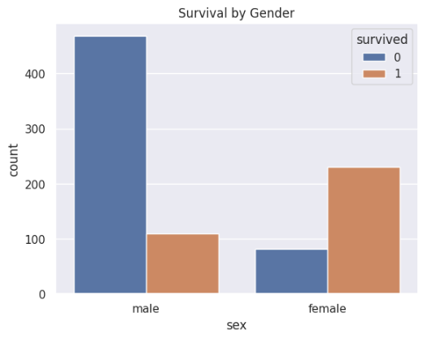
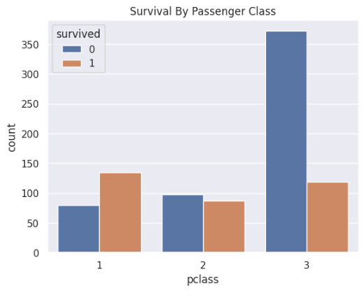
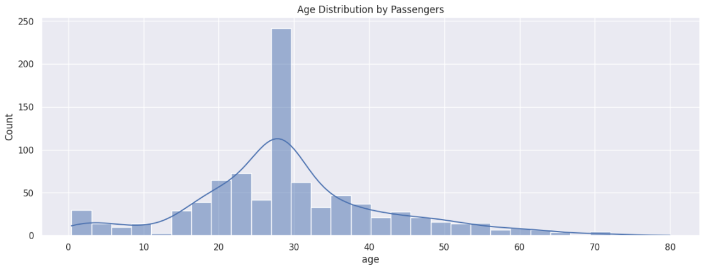
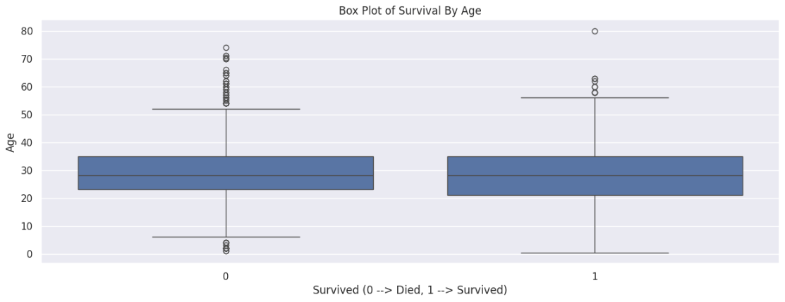
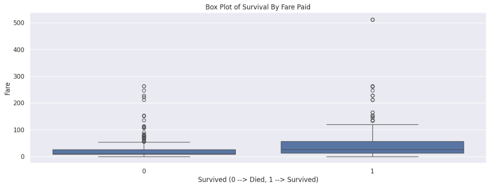
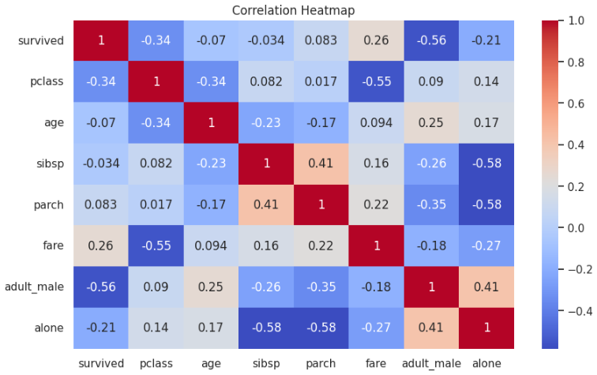
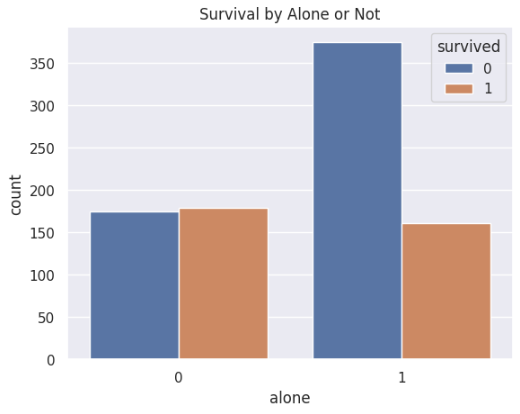

# 🛳️ Task 2 - Exploratory Data Analysis (EDA) on Titanic Dataset  

This project is part of my **Data Analytics Internship at Elevvo Pathways**.  
The objective was to perform **Exploratory Data Analysis (EDA)** on the **Titanic dataset** using Python to uncover patterns affecting passenger survival.  

---

## 📌 Steps Performed  

1. **Data Loading**  
   - Loaded Titanic dataset using Seaborn’s built-in dataset.  
   - Explored shape, datatypes, and missing values.  

2. **Data Cleaning**  
   - Dropped missing values in *embarked* and *embark_town*.  
   - Filled missing ages with median age.  
   - Created new features like *family_size* and *alone*.  

3. **Data Visualization & Insights**  
   Used **Matplotlib & Seaborn** to visualize patterns.  

---

## 📊 Visualizations  

### 🔹 Survival Count  
  

### 🔹 Survival by Gender  
  

### 🔹 Survival by Passenger Class  
  

### 🔹 Age Distribution of Passengers  
  

### 🔹 Survival by Age (Box Plot)  
  

### 🔹 Survival by Fare Paid  
  

### 🔹 Correlation Heatmap  
  

### 🔹 Survival by Family/Alone  
  

---

## 📈 Key Insights  

- 🚹 **Gender**: Female survival rate ~74% vs Male ~19%.  
- 🎟️ **Class**: 1st Class ~62% survival, 2nd Class ~47%, 3rd Class ~24%.  
- 👶 **Age**: Younger passengers were more likely to survive.  
- 💰 **Fare**: Higher fare passengers had better survival chances.  
- 👨‍👩‍👧 **Family**: Traveling with family improved survival compared to being alone.  

---

## 🛠️ Tools & Libraries Used  
- **Python**  
- **Pandas & NumPy** → Data cleaning and preprocessing  
- **Matplotlib & Seaborn** → Data visualization  

---

## 📜 Acknowledgement  
This project was completed as part of my **Data Analytics Internship at Elevvo Pathways**.  
