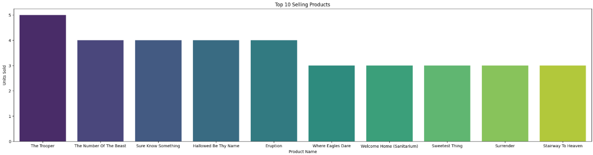
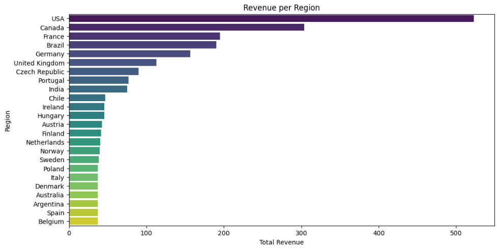
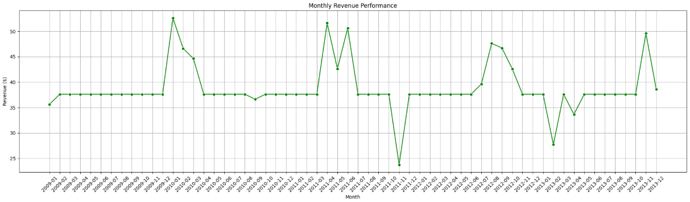
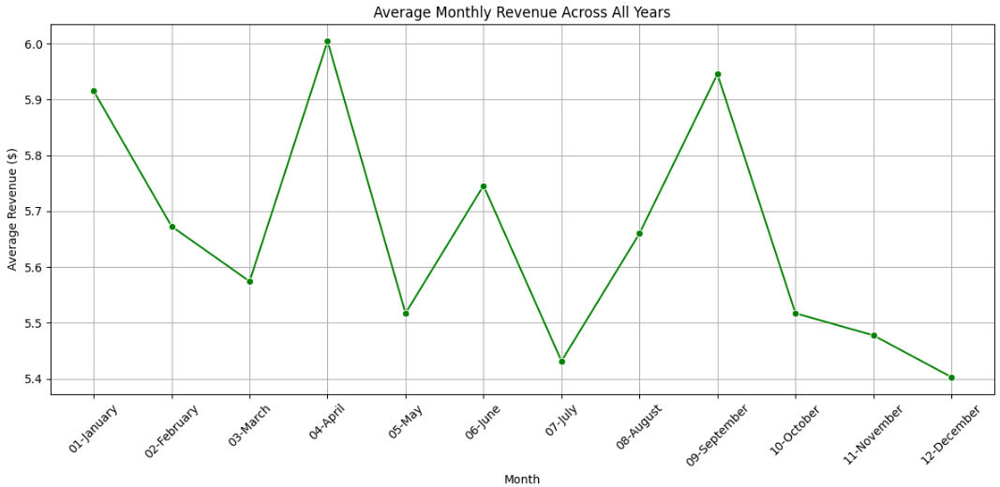
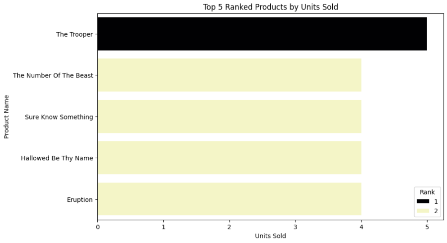

# 🗄️ SQL-Based Analysis of Product Sales (Chinook Database)  

This project was completed as part of my **Data Analytics Internship at Elevvo Pathways**.  
The objective of this task was to use **SQL queries** on the **Chinook Database** to extract business insights and then visualize the results using **Python (Matplotlib & Seaborn)**.  

---

## 📌 Project Overview  
The Chinook Database is a sample relational database containing information about a digital media store, including **customers, invoices, products, and regions**.  

In this task, I explored the database to answer important **business questions** such as:  
- Which products are the most popular?  
- Which regions generate the most revenue?  
- How do monthly revenue trends look over time?  
- What are the average monthly performance benchmarks?  
- Which functions rank the highest using SQL window functions?  

---

## 🛠️ Key Insights & Visualizations  

### 1️⃣ Top 10 Selling Products  
SQL query to identify the most purchased products.  
  

---

### 2️⃣ Revenue per Region  
Analyzed and compared revenue generated across different regions.  
  

---

### 3️⃣ Monthly Revenue Performance  
Tracked monthly revenue trends over time using line charts.  
  

---

### 4️⃣ Average Monthly Revenue Performance  
Calculated and visualized average monthly revenue as a baseline metric.  
  

---

### 5️⃣ Top 5 Ranked Functions (Bonus Task)  
Applied SQL **Window Function (RANK)** to identify the top 5 ranked functions.  
  

---

## 🚀 Skills Applied  
- SQL Querying & JOINs  
- Aggregations & Grouping  
- Window Functions (`RANK()`)  
- Python Data Visualization (Matplotlib, Seaborn)  
- Business Metrics & Insights  

---

## 📂 Files Included  
- `SQL_Queries.sql` → All SQL queries used for analysis  
- `Task_5_SQL_Based_Analysis_of_Product_Sales.ipynb` → Python notebook for executing queries and creating visualizations  
- `1st-visualization.png` → Top 10 Selling Products  
- `2nd-visualization.png` → Revenue per Region  
- `3rd-visualization.png` → Monthly Revenue Performance  
- `4th-visualization.png` → Average Monthly Revenue  
- `5th-visualization.png` → Top 5 Ranked Functions (Window Function)  

---

## 📸 Project Preview  
Below is a quick look at one of the visualizations:  
  

---

## 📜 Acknowledgement  
This project was completed as part of my **Data Analytics Internship at Elevvo Pathways**, under **Task 5: SQL-Based Analysis of Product Sales**.  

---

