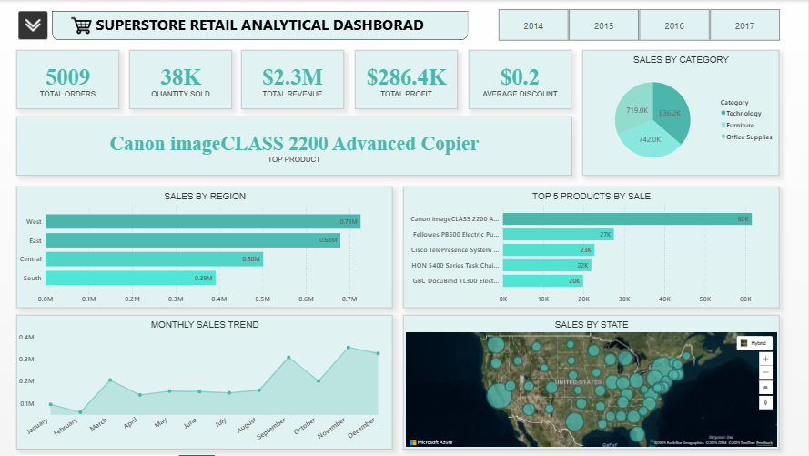
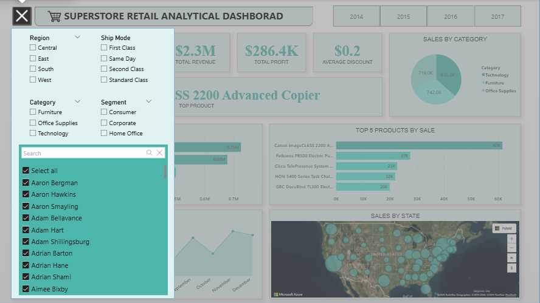

# 📊 Power BI Retail Insights Dashboard  

This project was completed as part of my **Data Analytics Internship at Elevvo Pathways**.  
The objective of this task was to build an **interactive Power BI dashboard** using the **Superstore Sales Dataset** to analyze and visualize retail performance.  

---

## 📌 Project Overview  
The dashboard provides a **decision-oriented view of business performance**, helping identify:  
- Regional and category-level performance  
- Top-selling products  
- Revenue and profit trends over time  
- Geographic distribution of sales across the U.S.  

---

## 🛠️ Key Features  

### 📈 KPIs  
- **Total Orders:** 5009  
- **Quantity Sold:** 38K  
- **Total Revenue:** $2.3M  
- **Total Profit:** $286.4K  
- **Average Discount:** $0.2  

### 📊 Visualizations  
1. **Sales by Region** – West, East, Central, South breakdown  
2. **Sales by Category** – Technology, Furniture, Office Supplies  
3. **Top 5 Products by Sales** – Canon imageCLASS 2200 led as top product  
4. **Monthly Sales Trend** – revenue fluctuations across the year  
5. **Sales by State (Map)** – U.S. geographic distribution  
6. **Dynamic Filters & Slicers** – by Region, Category, Segment, Ship Mode, and Customer  

---

## 📂 Files Included  
- `Retail_Dashboard.pbix` → Power BI dashboard file  
- `Superstore_Sales_Dataset.xlsx` → Dataset used  
- `screenshot1.png` → Dashboard KPIs + charts  
- `screenshot2.png` → Dashboard filters and slicers  

---

## 📸 Dashboard Preview  

### Main Dashboard  
  

### Filters & Slicers  
  

---

## 🚀 Skills Applied  
- Power BI Dashboarding  
- Data Modeling & DAX  
- KPI Creation & Business Metrics  
- Interactive Visualization Design  
- Business Storytelling with Data  

---

## 🔗 Related Internship Task  
This project corresponds to **Task 8** from the Elevvo Pathways Internship:  
*Power BI Dashboard for Retail Insights*  

---

## 📜 Acknowledgement  
This project was completed as part of my **Data Analytics Internship at Elevvo Pathways**.  

